# FinSkills 数据血缘（China-market）
本文件基于 `docs/view-deps.json` + `docs/view-specs/` 自动生成，用于评估数据源替换/缺失的影响范围。
## 总览图（Providers → Primitive Views → Feature Views）

```mermaid
flowchart LR
  classDef provider fill:#eef,stroke:#66f,stroke-width:1px;
  classDef primitive fill:#efe,stroke:#393,stroke-width:1px;
  classDef feature fill:#ffe,stroke:#aa0,stroke-width:1px;
  classDef skill fill:#fef,stroke:#909,stroke-width:1px;

  subgraph Providers
    eastmoney["EastMoney"]:::provider
    eastmoney_direct["EastMoney Direct"]:::provider
    sina["Sina"]:::provider
    xueqiu["Xueqiu"]:::provider
    akshare_macro_site_specific_["Macro Sites (AKShare)"]:::provider
    akshare_fundflow_site_specific_["FundFlow Sites (AKShare)"]:::provider
    akshare_hsgt_site_specific_["HSGT Sites (AKShare)"]:::provider
    akshare_lhb_site_specific_["LHB Sites (AKShare)"]:::provider
    akshare_zt_site_specific_["ZT Pool Sites (AKShare)"]:::provider
    akshare_margin_site_specific_["Margin Sites (AKShare)"]:::provider
    akshare_gpzy_site_specific_["Pledge Sites (AKShare)"]:::provider
    akshare_restricted_site_specific_["Restricted Sites (AKShare)"]:::provider
    akshare_sy_site_specific_["Goodwill Sites (AKShare)"]:::provider
    akshare_esg_site_specific_["ESG Sites (AKShare)"]:::provider
  end

  subgraph PrimitiveViews
    pv_hist_ohlcv["PV.HistOHLCV (A股/港股历史行情)"]:::primitive
    pv_realtime_quotes["PV.RealtimeQuotes (实时行情/盘口)"]:::primitive
    pv_basic_info["PV.BasicInfo (基础信息/行业/上市日期等)"]:::primitive
    pv_news_disclosure["PV.DisclosureNews (公告/信披/交易提示)"]:::primitive
    pv_block_deal["PV.BlockDeal (大宗交易)"]:::primitive
    pv_fin_statements["PV.FinStatements (三大报表)"]:::primitive
    pv_fin_metrics["PV.FinMetrics (关键财务指标/估值/质量)"]:::primitive
    pv_insider_mgmt["PV.InsiderMgmt (内部交易/高管增减持)"]:::primitive
    pv_macro_cn["PV.MacroCN (LPR/PMI/CPI/M2/Shibor/社融)"]:::primitive
    pv_fundflow["PV.FundFlow (资金流/主力/板块)"]:::primitive
    pv_northbound["PV.NorthboundHSGT (沪深港通/北向)"]:::primitive
    pv_lhb["PV.DragonTigerLHB (龙虎榜)"]:::primitive
    pv_zt_pool["PV.LimitUpDown (涨停池/强势股池)"]:::primitive
    pv_margin["PV.MarginFinancing (融资融券)"]:::primitive
    pv_pledge["PV.EquityPledge (股权质押)"]:::primitive
    pv_restricted["PV.RestrictedRelease (限售解禁)"]:::primitive
    pv_goodwill["PV.Goodwill (商誉/减值)"]:::primitive
    pv_esg["PV.ESG (ESG评分/等级)"]:::primitive
  end

  eastmoney --> pv_hist_ohlcv
  eastmoney_direct --> pv_hist_ohlcv
  sina --> pv_hist_ohlcv
  eastmoney --> pv_realtime_quotes
  eastmoney_direct --> pv_realtime_quotes
  xueqiu --> pv_realtime_quotes
  eastmoney --> pv_basic_info
  eastmoney --> pv_news_disclosure
  eastmoney --> pv_block_deal
  eastmoney --> pv_fin_statements
  sina --> pv_fin_statements
  eastmoney_direct --> pv_fin_metrics
  sina --> pv_fin_metrics
  xueqiu --> pv_insider_mgmt
  eastmoney_direct --> pv_insider_mgmt
  akshare_macro_site_specific_ --> pv_macro_cn
  akshare_fundflow_site_specific_ --> pv_fundflow
  akshare_hsgt_site_specific_ --> pv_northbound
  akshare_lhb_site_specific_ --> pv_lhb
  akshare_zt_site_specific_ --> pv_zt_pool
  akshare_margin_site_specific_ --> pv_margin
  akshare_gpzy_site_specific_ --> pv_pledge
  akshare_restricted_site_specific_ --> pv_restricted
  akshare_sy_site_specific_ --> pv_goodwill
  akshare_esg_site_specific_ --> pv_esg

  subgraph FeatureViews
    macro_china_dashboard["Macro Dashboard"]:::feature
    market_overview_dashboard["Market Overview Dashboard"]:::feature
    fund_flow_dashboard["Fund Flow Dashboard"]:::feature
    hsgt_dashboard["HSGT Dashboard"]:::feature
    dragon_tiger_daily["Dragon-Tiger Daily"]:::feature
    dragon_tiger_stock_detail["Dragon-Tiger Stock Detail"]:::feature
    limit_up_pool_daily["Limit-Up Pool Daily"]:::feature
    equity_pledge_dashboard["Equity Pledge Dashboard"]:::feature
    margin_dashboard["Margin Dashboard"]:::feature
    block_deal_dashboard["Block Deal Dashboard"]:::feature
    repurchase_dashboard["Repurchase Dashboard"]:::feature
    restricted_release_dashboard["Restricted Release Dashboard"]:::feature
    goodwill_dashboard["Goodwill Dashboard"]:::feature
    dividend_actions_dashboard["Dividend Actions Dashboard"]:::feature
    notice_daily_dashboard["Notice Daily Dashboard"]:::feature
    report_disclosure_calendar["Disclosure Calendar"]:::feature
    cninfo_disclosure_search["CNINFO Search"]:::feature
    cninfo_disclosure_relation_search["CNINFO Relation Search"]:::feature
    concept_board_snapshot["Concept Board Snapshot"]:::feature
    concept_board_detail["Concept Board Detail"]:::feature
    industry_board_snapshot["Industry Board Snapshot"]:::feature
    industry_board_detail["Industry Board Detail"]:::feature
    hot_rank_sentiment_dashboard["Hot Rank / Sentiment Dashboard"]:::feature
    ipo_newlist_dashboard["IPO Newlist Dashboard"]:::feature
    shareholder_structure_dashboard["Shareholder Structure Dashboard"]:::feature
    st_delist_dashboard["ST/Delist Dashboard"]:::feature
    intraday_microstructure_dashboard["Intraday Microstructure Dashboard"]:::feature
    ab_ah_premium_dashboard["AB/AH Premium Dashboard"]:::feature
  end

  pv_macro_cn --> macro_china_dashboard
  pv_fundflow --> fund_flow_dashboard
  pv_fundflow --> hsgt_dashboard
  pv_northbound --> hsgt_dashboard
  pv_lhb --> dragon_tiger_daily
  pv_lhb --> dragon_tiger_stock_detail
  pv_zt_pool --> limit_up_pool_daily
  pv_pledge --> equity_pledge_dashboard
  pv_margin --> margin_dashboard
  pv_block_deal --> block_deal_dashboard
  pv_news_disclosure --> repurchase_dashboard
  pv_restricted --> restricted_release_dashboard
  pv_goodwill --> goodwill_dashboard
  pv_news_disclosure --> dividend_actions_dashboard
  pv_news_disclosure --> notice_daily_dashboard
  pv_news_disclosure --> report_disclosure_calendar
  pv_fundflow --> industry_board_snapshot
  pv_news_disclosure --> st_delist_dashboard
  pv_realtime_quotes --> intraday_microstructure_dashboard

```

## Primitive Views 影响面
| Primitive View | 可选提供方（akshare-one/AKShare） | 受影响 skills 数 | skills |
| --- | --- | ---: | --- |
| PV.HistOHLCV (A股/港股历史行情) | eastmoney, eastmoney_direct, sina | 20 | bse-selection-analyzer, convertible-bond-scanner, equity-research-orchestrator, etf-allocator, event-driven-detector, event-study, factor-crowding-monitor, investment-memo-generator, limit-up-limit-down-risk-checker, market-breadth-monitor, peer-comparison-analyzer, portfolio-health-check, portfolio-monitor-orchestrator, rebalancing-planner, risk-adjusted-return-optimizer, shareholder-risk-check, suitability-report-generator, tech-hype-vs-fundamentals ... |
| PV.RealtimeQuotes (实时行情/盘口) | eastmoney, eastmoney_direct, xueqiu | 8 | bse-selection-analyzer, esg-screener, event-driven-detector, event-study, intraday-microstructure-analyzer, quant-factor-screener, small-cap-growth-identifier, undervalued-stock-screener |
| PV.BasicInfo (基础信息/行业/上市日期等) | eastmoney | 13 | bse-selection-analyzer, convertible-bond-scanner, equity-research-orchestrator, etf-allocator, factor-crowding-monitor, investment-memo-generator, limit-up-limit-down-risk-checker, market-breadth-monitor, peer-comparison-analyzer, shareholder-risk-check, suitability-report-generator, tech-hype-vs-fundamentals, weekly-market-brief-generator |
| PV.DisclosureNews (公告/信披/交易提示) | eastmoney | 5 | disclosure-notice-monitor, dividend-corporate-action-tracker, high-dividend-strategy, share-repurchase-monitor, st-delist-risk-scanner |
| PV.BlockDeal (大宗交易) | eastmoney | 1 | block-deal-monitor |
| PV.FinStatements (三大报表) | eastmoney, sina | 2 | bse-selection-analyzer, financial-statement-analyzer |
| PV.FinMetrics (关键财务指标/估值/质量) | eastmoney_direct, sina | 6 | esg-screener, financial-statement-analyzer, quant-factor-screener, small-cap-growth-identifier, undervalued-stock-screener, valuation-regime-detector |
| PV.InsiderMgmt (内部交易/高管增减持) | xueqiu, eastmoney_direct | 1 | insider-trading-analyzer |
| PV.MacroCN (LPR/PMI/CPI/M2/Shibor/社融) | akshare-macro (site-specific) | 3 | liquidity-impact-estimator, macro-liquidity-monitor, policy-sensitivity-brief |
| PV.FundFlow (资金流/主力/板块) | akshare-fundflow (site-specific) | 6 | fund-flow-monitor, hsgt-holdings-monitor, industry-board-analyzer, industry-chain-mapper, northbound-flow-analyzer, sector-rotation-detector |
| PV.NorthboundHSGT (沪深港通/北向) | akshare-hsgt (site-specific) | 2 | hsgt-holdings-monitor, northbound-flow-analyzer |
| PV.DragonTigerLHB (龙虎榜) | akshare-lhb (site-specific) | 1 | dragon-tiger-list-analyzer |
| PV.LimitUpDown (涨停池/强势股池) | akshare-zt (site-specific) | 1 | limit-up-pool-analyzer |
| PV.MarginFinancing (融资融券) | akshare-margin (site-specific) | 1 | margin-risk-monitor |
| PV.EquityPledge (股权质押) | akshare-gpzy (site-specific) | 1 | equity-pledge-risk-monitor |
| PV.RestrictedRelease (限售解禁) | akshare-restricted (site-specific) | 1 | ipo-lockup-risk-monitor |
| PV.Goodwill (商誉/减值) | akshare-sy (site-specific) | 1 | goodwill-risk-monitor |
| PV.ESG (ESG评分/等级) | akshare-esg (site-specific) | 1 | esg-screener |

## 备注
- `eastmoney/eastmoney_direct/sina/xueqiu` 的多提供方能力来自 akshare-one 的 `source` 参数设计。
- 其余标注为 `site-specific` 的 primitive 当前对应的是 AKShare 的站点级接口集合：可替换性通常取决于你是否有备选数据供应商或自建采集。
