# FinSkills View API 设计规范（Draft）

目标：把“取数不稳定、易改版、易限流”等问题收敛到你维护的后端服务（一个 **MCP 风格的 View 服务**）；本仓库只负责**调用 view** 并原样消费结果（不做无意义的本地格式转换/清洗），从而达到产品级可用性。

约束：**只暴露 view**（不暴露底层 tool/上游细节）。后端可以用任意数据源/实现策略生成 view 的结果。

---

## 0. 总览（Providers → Primitive Views → Feature Views）

建议的分层：

- **Providers**：对接上游数据源的“采集器/适配器”（可多源冗余、可切换、可降级），属于服务端内部实现细节。
- **Primitive Views**：稳定可复用的“原语视图”（尽量一类数据一个 view），用于复用、缓存、血缘追踪与组合。
- **Feature Views**：面向业务/技能的“聚合视图”（Dashboard/Panel），由多个 Primitive Views 组合而成，输出可直接用于分析。

> 注意：本仓库客户端只调用 **view**。你可以选择把 Primitive Views 也作为公开 views 暴露（强烈建议，便于调试/复用），也可以只内部使用。

### 总览图（示意）

```mermaid
flowchart LR
  classDef provider fill:#eef,stroke:#66f,stroke-width:1px;
  classDef primitive fill:#efe,stroke:#393,stroke-width:1px;
  classDef feature fill:#ffe,stroke:#aa0,stroke-width:1px;
  classDef skill fill:#fef,stroke:#909,stroke-width:1px;

  subgraph Providers
    eastmoney["EastMoney"]:::provider
    eastmoney_direct["EastMoney Direct"]:::provider
    sina["Sina"]:::provider
    xueqiu["Xueqiu"]:::provider
    akshare_macro_site_specific_["Macro Sites (AKShare)"]:::provider
    akshare_fundflow_site_specific_["FundFlow Sites (AKShare)"]:::provider
    akshare_hsgt_site_specific_["HSGT Sites (AKShare)"]:::provider
    akshare_lhb_site_specific_["LHB Sites (AKShare)"]:::provider
    akshare_zt_site_specific_["ZT Pool Sites (AKShare)"]:::provider
    akshare_margin_site_specific_["Margin Sites (AKShare)"]:::provider
    akshare_gpzy_site_specific_["Pledge Sites (AKShare)"]:::provider
    akshare_restricted_site_specific_["Restricted Sites (AKShare)"]:::provider
    akshare_sy_site_specific_["Goodwill Sites (AKShare)"]:::provider
    akshare_esg_site_specific_["ESG Sites (AKShare)"]:::provider
  end

  subgraph PrimitiveViews
    pv_hist_ohlcv["PV.HistOHLCV (A股/港股历史行情)"]:::primitive
    pv_realtime_quotes["PV.RealtimeQuotes (实时行情/盘口)"]:::primitive
    pv_basic_info["PV.BasicInfo (基础信息/行业/上市日期等)"]:::primitive
    pv_news_disclosure["PV.DisclosureNews (公告/信披/交易提示)"]:::primitive
    pv_block_deal["PV.BlockDeal (大宗交易)"]:::primitive
    pv_fin_statements["PV.FinStatements (三大报表)"]:::primitive
    pv_fin_metrics["PV.FinMetrics (关键财务指标/估值/质量)"]:::primitive
    pv_insider_mgmt["PV.InsiderMgmt (内部交易/高管增减持)"]:::primitive
    pv_macro_cn["PV.MacroCN (LPR/PMI/CPI/M2/Shibor/社融)"]:::primitive
    pv_fundflow["PV.FundFlow (资金流/主力/板块)"]:::primitive
    pv_northbound["PV.NorthboundHSGT (沪深港通/北向)"]:::primitive
    pv_lhb["PV.DragonTigerLHB (龙虎榜)"]:::primitive
    pv_zt_pool["PV.LimitUpDown (涨停池/强势股池)"]:::primitive
    pv_margin["PV.MarginFinancing (融资融券)"]:::primitive
    pv_pledge["PV.EquityPledge (股权质押)"]:::primitive
    pv_restricted["PV.RestrictedRelease (限售解禁)"]:::primitive
    pv_goodwill["PV.Goodwill (商誉/减值)"]:::primitive
    pv_esg["PV.ESG (ESG评分/等级)"]:::primitive
  end

  eastmoney --> pv_hist_ohlcv
  eastmoney_direct --> pv_hist_ohlcv
  sina --> pv_hist_ohlcv
  eastmoney --> pv_realtime_quotes
  eastmoney_direct --> pv_realtime_quotes
  xueqiu --> pv_realtime_quotes
  eastmoney --> pv_basic_info
  eastmoney --> pv_news_disclosure
  eastmoney --> pv_block_deal
  eastmoney --> pv_fin_statements
  sina --> pv_fin_statements
  eastmoney_direct --> pv_fin_metrics
  sina --> pv_fin_metrics
  xueqiu --> pv_insider_mgmt
  eastmoney_direct --> pv_insider_mgmt
  akshare_macro_site_specific_ --> pv_macro_cn
  akshare_fundflow_site_specific_ --> pv_fundflow
  akshare_hsgt_site_specific_ --> pv_northbound
  akshare_lhb_site_specific_ --> pv_lhb
  akshare_zt_site_specific_ --> pv_zt_pool
  akshare_margin_site_specific_ --> pv_margin
  akshare_gpzy_site_specific_ --> pv_pledge
  akshare_restricted_site_specific_ --> pv_restricted
  akshare_sy_site_specific_ --> pv_goodwill
  akshare_esg_site_specific_ --> pv_esg

  subgraph FeatureViews
    macro_china_dashboard["Macro Dashboard"]:::feature
    market_overview_dashboard["Market Overview Dashboard"]:::feature
    fund_flow_dashboard["Fund Flow Dashboard"]:::feature
    hsgt_dashboard["HSGT Dashboard"]:::feature
    dragon_tiger_daily["Dragon-Tiger Daily"]:::feature
    dragon_tiger_stock_detail["Dragon-Tiger Stock Detail"]:::feature
    limit_up_pool_daily["Limit-Up Pool Daily"]:::feature
    equity_pledge_dashboard["Equity Pledge Dashboard"]:::feature
    margin_dashboard["Margin Dashboard"]:::feature
    block_deal_dashboard["Block Deal Dashboard"]:::feature
    repurchase_dashboard["Repurchase Dashboard"]:::feature
    restricted_release_dashboard["Restricted Release Dashboard"]:::feature
    goodwill_dashboard["Goodwill Dashboard"]:::feature
    dividend_actions_dashboard["Dividend Actions Dashboard"]:::feature
    notice_daily_dashboard["Notice Daily Dashboard"]:::feature
    report_disclosure_calendar["Disclosure Calendar"]:::feature
    cninfo_disclosure_search["CNINFO Search"]:::feature
    cninfo_disclosure_relation_search["CNINFO Relation Search"]:::feature
    concept_board_snapshot["Concept Board Snapshot"]:::feature
    concept_board_detail["Concept Board Detail"]:::feature
    industry_board_snapshot["Industry Board Snapshot"]:::feature
    industry_board_detail["Industry Board Detail"]:::feature
    hot_rank_sentiment_dashboard["Hot Rank / Sentiment Dashboard"]:::feature
    ipo_newlist_dashboard["IPO Newlist Dashboard"]:::feature
    shareholder_structure_dashboard["Shareholder Structure Dashboard"]:::feature
    st_delist_dashboard["ST/Delist Dashboard"]:::feature
    intraday_microstructure_dashboard["Intraday Microstructure Dashboard"]:::feature
    ab_ah_premium_dashboard["AB/AH Premium Dashboard"]:::feature
  end

  pv_macro_cn --> macro_china_dashboard
  pv_fundflow --> fund_flow_dashboard
  pv_fundflow --> hsgt_dashboard
  pv_northbound --> hsgt_dashboard
  pv_lhb --> dragon_tiger_daily
  pv_lhb --> dragon_tiger_stock_detail
  pv_zt_pool --> limit_up_pool_daily
  pv_pledge --> equity_pledge_dashboard
  pv_margin --> margin_dashboard
  pv_block_deal --> block_deal_dashboard
  pv_news_disclosure --> repurchase_dashboard
  pv_restricted --> restricted_release_dashboard
  pv_goodwill --> goodwill_dashboard
  pv_news_disclosure --> dividend_actions_dashboard
  pv_news_disclosure --> notice_daily_dashboard
  pv_news_disclosure --> report_disclosure_calendar
  pv_fundflow --> industry_board_snapshot
  pv_news_disclosure --> st_delist_dashboard
  pv_realtime_quotes --> intraday_microstructure_dashboard
```



### Primitive Views 影响面（参考）

> 用途：帮助你在服务端优先把 Primitive Views 做稳（缓存/降级/字段稳定性），因为它们会影响多个 Feature Views 与 skills。

| Primitive View | 可选提供方（akshare-one/AKShare） | 受影响 skills 数 | skills |
| --- | --- | ---: | --- |
| PV.HistOHLCV (A股/港股历史行情) | eastmoney, eastmoney_direct, sina | 20 | bse-selection-analyzer, convertible-bond-scanner, equity-research-orchestrator, etf-allocator, event-driven-detector, event-study, factor-crowding-monitor, investment-memo-generator, limit-up-limit-down-risk-checker, market-breadth-monitor, peer-comparison-analyzer, portfolio-health-check, portfolio-monitor-orchestrator, rebalancing-planner, risk-adjusted-return-optimizer, shareholder-risk-check, suitability-report-generator, tech-hype-vs-fundamentals ... |
| PV.RealtimeQuotes (实时行情/盘口) | eastmoney, eastmoney_direct, xueqiu | 8 | bse-selection-analyzer, esg-screener, event-driven-detector, event-study, intraday-microstructure-analyzer, quant-factor-screener, small-cap-growth-identifier, undervalued-stock-screener |
| PV.BasicInfo (基础信息/行业/上市日期等) | eastmoney | 13 | bse-selection-analyzer, convertible-bond-scanner, equity-research-orchestrator, etf-allocator, factor-crowding-monitor, investment-memo-generator, limit-up-limit-down-risk-checker, market-breadth-monitor, peer-comparison-analyzer, shareholder-risk-check, suitability-report-generator, tech-hype-vs-fundamentals, weekly-market-brief-generator |
| PV.DisclosureNews (公告/信披/交易提示) | eastmoney | 5 | disclosure-notice-monitor, dividend-corporate-action-tracker, high-dividend-strategy, share-repurchase-monitor, st-delist-risk-scanner |
| PV.BlockDeal (大宗交易) | eastmoney | 1 | block-deal-monitor |
| PV.FinStatements (三大报表) | eastmoney, sina | 2 | bse-selection-analyzer, financial-statement-analyzer |
| PV.FinMetrics (关键财务指标/估值/质量) | eastmoney_direct, sina | 6 | esg-screener, financial-statement-analyzer, quant-factor-screener, small-cap-growth-identifier, undervalued-stock-screener, valuation-regime-detector |
| PV.InsiderMgmt (内部交易/高管增减持) | xueqiu, eastmoney_direct | 1 | insider-trading-analyzer |
| PV.MacroCN (LPR/PMI/CPI/M2/Shibor/社融) | akshare-macro (site-specific) | 3 | liquidity-impact-estimator, macro-liquidity-monitor, policy-sensitivity-brief |
| PV.FundFlow (资金流/主力/板块) | akshare-fundflow (site-specific) | 6 | fund-flow-monitor, hsgt-holdings-monitor, industry-board-analyzer, industry-chain-mapper, northbound-flow-analyzer, sector-rotation-detector |
| PV.NorthboundHSGT (沪深港通/北向) | akshare-hsgt (site-specific) | 2 | hsgt-holdings-monitor, northbound-flow-analyzer |
| PV.DragonTigerLHB (龙虎榜) | akshare-lhb (site-specific) | 1 | dragon-tiger-list-analyzer |
| PV.LimitUpDown (涨停池/强势股池) | akshare-zt (site-specific) | 1 | limit-up-pool-analyzer |
| PV.MarginFinancing (融资融券) | akshare-margin (site-specific) | 1 | margin-risk-monitor |
| PV.EquityPledge (股权质押) | akshare-gpzy (site-specific) | 1 | equity-pledge-risk-monitor |
| PV.RestrictedRelease (限售解禁) | akshare-restricted (site-specific) | 1 | ipo-lockup-risk-monitor |
| PV.Goodwill (商誉/减值) | akshare-sy (site-specific) | 1 | goodwill-risk-monitor |
| PV.ESG (ESG评分/等级) | akshare-esg (site-specific) | 1 | esg-screener |

---

## 1. 术语

- **View**：一个可调用的数据视图，入参为 JSON 对象，输出为 JSON Envelope。
- **Envelope**：统一的返回结构：`{meta, data, warnings, errors}`。
- **Refresh**：是否强制绕过缓存，触发后端重新取数/计算。
- **Primitive View**：稳定、可缓存、尽量单一职责的数据视图（建议对外可见）。
- **Feature View**：聚合视图（Dashboard），由多个 Primitive View 组合而成（建议 `data` 返回子视图的 envelope 字典）。
- **Tool View（可选）**：把“底层接口/单一数据表”也当作 view 暴露（view 名 == 底层函数/数据集名）。客户端同样按 view 调用，不需要知道其来源。
- **Provider**：对接上游的采集器/适配器（内部实现）。

---

## 2. HTTP API（v1）

### 2.1 基础约定

- Base URL：例如 `https://your-domain.example.com`
- Content-Type：`application/json; charset=utf-8`
- 字符编码：UTF-8
- 时区：`meta.as_of` 使用 ISO 8601（推荐包含时区偏移）
- 建议支持压缩：`Content-Encoding: gzip`（对大表格很关键）

命名与兼容性建议：

- view 名称推荐 `snake_case`（小写+下划线）；客户端会尝试把 `-` 与 `_` 做互换（便于迁移）。
- 股票代码/基金代码/债券代码：**一律当字符串处理**（保留前导 0）。

### 2.2 鉴权（可选但建议）

二选一（推荐 Bearer）：

- `Authorization: Bearer <token>`
- 或 `X-API-Key: <key>`

鉴权失败建议返回 `401`，同时仍返回 Envelope（见 3.5）。

### 2.3 Endpoint：健康检查

`GET /health`

返回（示例）：

```json
{"ok": true}
```

### 2.4 Endpoint：列出可用 views

`GET /views`

可选查询参数（建议）：

- `contains`: 子串过滤
- `prefix`: 前缀过滤
- `kind`: `primitive|feature|any`（可选；若不支持可忽略）

返回（示例）：

```json
{
  "views": ["margin_dashboard", "repurchase_dashboard", "pv_hist_ohlcv"],
  "count": 2
}
```

建议增强返回（可选）：

```json
{
  "views": [
    {"name": "pv_hist_ohlcv", "kind": "primitive", "description": "..."},
    {"name": "margin_dashboard", "kind": "feature", "description": "..."}
  ],
  "count": 2
}
```

### 2.5 Endpoint：查看 view 规格（schema）

`GET /views/{name}`

返回（示例）：

```json
{
  "name": "repurchase_dashboard",
  "kind": "feature",
  "description": "…",
  "params_schema": {"type": "object", "properties": {}, "required": []},
  "output_hint": {"kind": "feature", "shape": "envelope_map"}
}
```

说明：

- `params_schema` 使用 JSON Schema（draft-07 及以上均可，但需在 `meta.spec_version` 固定）。
- `output_hint` 仅作提示；真正的契约在 `view-envelope@1`（3 节）与“Feature View 输出约定”（3.6）。

### 2.6 Endpoint：运行 view

`POST /run`

请求体（最小）：

```json
{
  "name": "repurchase_dashboard",
  "params": {"symbol": "000001"},
  "refresh": false
}
```

返回：JSON Envelope（见第 3 节）。

---

## 3. JSON Envelope 规范（view-envelope@1）

### 3.1 顶层字段

必须包含：

- `meta`（object）
- `data`（any JSON）
- `warnings`（array）
- `errors`（array）

### 3.1.1 JSON 兼容性约束（强制）

为确保跨语言消费，服务端必须保证：

- 不输出 `NaN/Infinity`（应转成 `null` 或字符串，并加 warning）
- `datetime/date` 一律输出字符串（ISO 8601 或 `YYYYMMDD`）
- `bytes` 不直接输出（需要 base64 或完全避免）

### 3.2 `meta` 必填字段

- `spec_version`：固定为 `view-envelope@1`
- `provider`：后端标识（如 `mcp-http` / `remote-view-service`）
- `view`：view 名称
- `as_of`：结果生成时间（ISO 8601）
- `elapsed_seconds`：后端执行耗时（秒，float）
- `params`：回显实际生效入参（object）

建议包含但不强制：

- `request_id`：用于排障的请求标识（建议服务端生成）
- `trace_id`：链路追踪（可由客户端传入，也可服务端生成）
- `kind`：`primitive|feature`
- `source`：数据来源标识列表（例如 `["eastmoney"]`，仅用于调试，不建议客户端写死依赖）
- `deps`：依赖的 Primitive Views 列表（用于血缘/排障）

### 3.3 缓存字段（建议）

若后端有缓存，建议在 `meta.cache` 提供：

```json
{
  "hit": true,
  "ttl_seconds": 300,
  "age_seconds": 12.3,
  "stale": false
}
```

语义建议：

- `refresh=false`：优先命中缓存；若上游失败可选“返回 stale 缓存 + warning”（产品可用性更好）。
- `refresh=true`：绕过缓存重新计算；若失败，可选“fallback stale 缓存 + warning”，但必须明确标注。

### 3.4 结果摘要字段（建议）

为便于“靠谱程度”判断，建议在 `meta.result` 提供轻量摘要：

- `type`: `list|dict|table|none|…`
- `rows`: 行数（若可得）
- `columns`: 列名列表（若可得）
- `keys`: 键数量（若 `dict`）

### 3.5 `warnings` / `errors` 规范

类型：数组（推荐 `list[str]`，兼容当前工具包）。

建议字符串格式：

- `"[CODE] message"`

推荐 CODE（可扩展）：

- `INVALID_PARAMS`：参数不合法/缺失
- `VIEW_NOT_FOUND`：未知 view
- `UPSTREAM_TIMEOUT`：上游超时
- `UPSTREAM_CHANGED`：上游字段/结构变化
- `RATE_LIMITED`：被限流
- `EMPTY_RESULT`：返回为空（必须提示“空 ≠ 无事件”）
- `PARTIAL_RESULT`：部分数据成功，部分失败
- `STALE_CACHE`：返回了过期缓存（为了可用性）
- `AUTH_FAILED`：鉴权失败
- `INTERNAL_ERROR`：后端内部错误

重要：即使发生 4xx/5xx，也尽量返回 Envelope；`errors` 非空即代表本次调用不可用或需人工确认。

### 3.6 Feature View 输出约定（强烈建议）

为了复用与可观测性，Feature View 建议返回“组件字典”，每个组件仍是一个 Envelope：

```json
{
  "meta": {"spec_version": "view-envelope@1", "view": "margin_dashboard", "kind": "feature", "...": "..."},
  "data": {
    "summary": {"meta": {"spec_version": "view-envelope@1", "view": "pv_margin_summary", "kind": "primitive", "...": "..."}, "data": [], "warnings": [], "errors": []},
    "detail": {"meta": {"spec_version": "view-envelope@1", "view": "pv_margin_detail", "kind": "primitive", "...": "..."}, "data": [], "warnings": [], "errors": []}
  },
  "warnings": ["[PARTIAL_RESULT] ..."],
  "errors": []
}
```

好处：

- 任何子组件为空/异常都能被精确定位（而不是把错误“糊成一坨”）
- 便于把 Feature View 的子组件复用为独立 Primitive View

---

## 4. 客户端集成建议（本仓库）

原则：**客户端只做转发与最小校验**；不做字段改名/结构转换。

建议做成“多后端/多 Provider”：

1. **Remote（默认）**：调用你维护的 View API（更稳定、可控、可缓存）。
2. **Local（可选兜底）**：本地直连数据源（仅用于开发/应急）。
3. **Chain（可选）**：remote 失败 → local（需要明确 `meta.provider` 标注最终来源）。

落地位置（建议）：

- `China-market/findata-toolkit-cn/scripts/views_runner.py`：新增 `--remote-url` / `FINSKILLS_VIEW_API_URL` 模式，`list/describe/run` 直接转发到远端。
- `view-service`：增加 remote backend（把 `/run` 代理到远端），或作为本地调试服务器保留。

### 4.1 `views_runner.py` 远端模式约定（必须满足）

环境变量（参考实现）：

- `FINSKILLS_VIEW_API_URL`：远端 base url（如 `http://127.0.0.1:8808`）
- `FINSKILLS_VIEW_API_TOKEN`：Bearer Token（可选）
- `FINSKILLS_VIEW_API_KEY`：API Key（可选）
- `FINSKILLS_VIEW_API_TIMEOUT`：超时秒数（可选，默认 30）

行为：

- `list/describe/run` 直接走远端 HTTP，不依赖本地数据源与依赖包。
- 客户端会尝试 `-` 与 `_` 的 view 名互换（便于迁移），服务端最好也兼容或至少返回清晰的 `VIEW_NOT_FOUND`。

---

## 5. 验收标准（产品级）

- **契约稳定**：`view-envelope@1` 不破坏兼容；新增字段只增不删。
- **可观测**：每次返回有 `as_of`、`elapsed_seconds`、`request_id`（建议）。
- **可用性优先**：支持缓存与 `refresh`，必要时允许 `STALE_CACHE` 降级。
- **错误可解释**：`errors/warnings` 有 CODE，能快速定位是“参数问题/上游问题/限流/空结果/内部错误”。

---

## 6. 服务端实现要求（建议写进 PRD / 验收）

这部分不是“接口定义”，但决定能否达到产品级稳定性。

### 6.1 参数校验与 Schema

- `/views/{name}` 必须给出 `params_schema`（JSON Schema）。
- `/run` 必须对 `params` 做校验：缺参、类型错误要返回 `INVALID_PARAMS`，不要把异常堆栈直接暴露给客户端。
- 对“日期/代码”这类易错入参：建议服务端也做“宽松解析 + 规范化回显”（例如 `meta.params` 把 `2026-02-01` 规范成 `20260201`）。

### 6.2 可用性：缓存、重试、降级

- 视图应有 TTL 缓存（至少内存/Redis 二选一；最好同时落盘作 warm cache）。
- 上游请求失败：有限重试（指数退避 + 抖动），避免雪崩。
- 允许返回 `STALE_CACHE`（陈旧缓存）作为降级策略，但必须在 `meta.cache.stale=true` 且 `warnings` 标注。

### 6.3 可靠性：上游改版/字段漂移

- 对“表格列名/字段结构”建立契约测试（golden sample），一旦漂移：返回 `UPSTREAM_CHANGED` warning，并在服务端记录告警。
- 对空结果必须加 `EMPTY_RESULT` warning（避免用户误判为“无事件/无风险”）。

### 6.4 观测性

- 每次 `/run` 产生 `request_id`，并在服务端日志里可追踪（含 view、params、耗时、cache hit、错误码）。
- 建议暴露 `/metrics`（Prometheus）或类似指标：成功率、p95 延迟、上游错误、缓存命中率。

### 6.5 安全与配额

- 必须有最基本的鉴权方式（Bearer/API Key）。
- 建议按 token 做 QPS/并发限制（防止误用导致上游被封）。
- 记录审计日志（至少 view 名 + 时间 + 调用方标识 + 是否 refresh）。

---

## 7. MVP（第一版）建议范围

为了让本仓库“接入即可用”，建议第一版至少做到：

1. 实现 `/health`、`/views`、`/views/{name}`、`/run`（HTTP+JSON）。
2. `/run` 返回严格符合 `view-envelope@1` 的 Envelope（含 `meta.spec_version/provider/view/as_of/elapsed_seconds/params`）。
3. 实现最小缓存（TTL 可配置）+ `refresh` 语义。
4. 至少覆盖一组关键 Feature Views（建议从 `margin_dashboard`、`repurchase_dashboard`、`block_deal_dashboard`、`macro_china_dashboard` 开始）。
5. 错误码与 warning 规范落地（`INVALID_PARAMS/VIEW_NOT_FOUND/EMPTY_RESULT/UPSTREAM_CHANGED/RATE_LIMITED/INTERNAL_ERROR`）。
